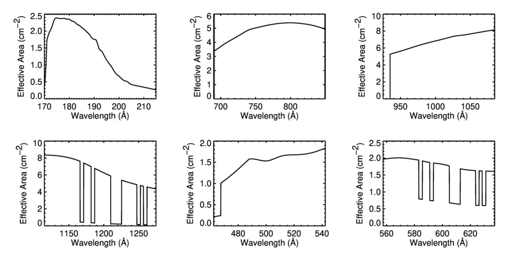

# EUVST Effective Area - v0.1

Some very crude initial routines for computing EUVST count rates. The software developed by Peter
Young for LEMUR has been used to create lookup tables. These routines read the lookup tables and
interpolate the effective area for the input wavelength.

For example,

```
IDL> ints = euvst_ints2counts(977.02, 1.0E+3, 1.0, /verbose)
    wavelength = 977.020 Angstrom
      intensity = 1000.00 erg/cm^2/s/sr
      intensity = 4.91e+13 ph/cm^2/s/sr
 effective area = 6.33 cm^2
   x pixel size = 0.18 arcsec
   y pixel size = 0.18 arcsec
  exposure time = 1.0 s
   total counts = 236.5
```   

and 

```
IDL> ea = euvst_wave2ea(977.02)
IDL> print, ea
       6.3262800
```



